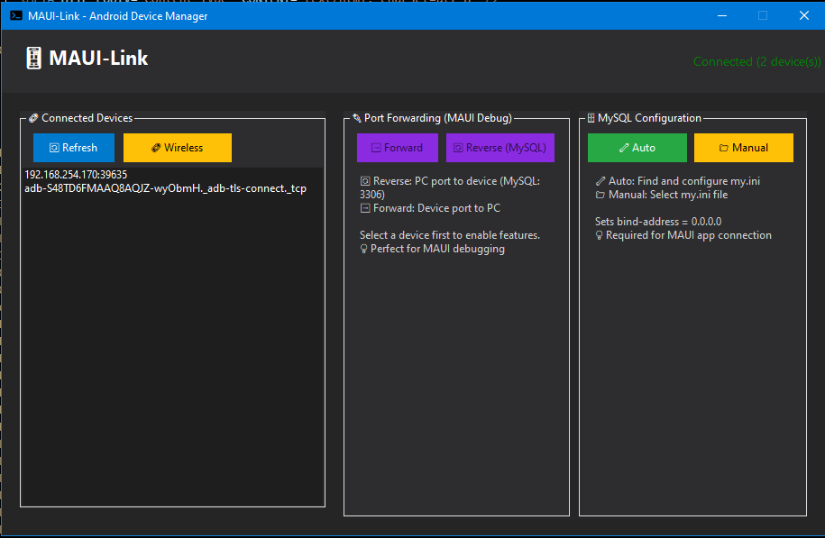
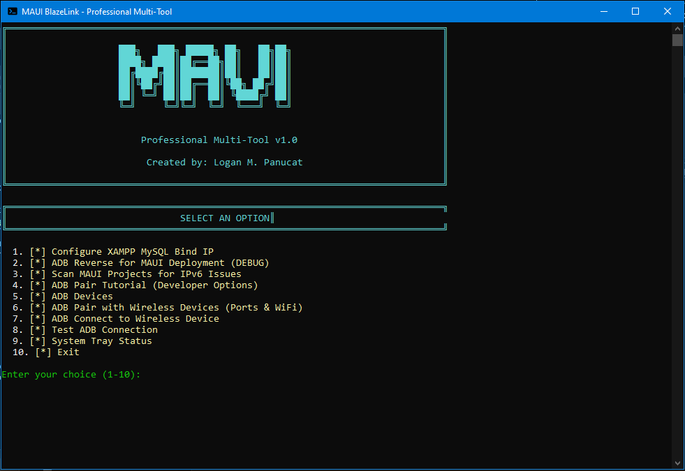

# MAUI-Link - ADB Wireless & Port Forwarding Tool

A focused Windows Forms application for Android device connectivity and port forwarding through ADB (Android Debug Bridge). MAUI-Link specializes in wireless ADB connections and reverse port forwarding for .NET MAUI development, making it easier to debug applications with local databases.

## 🚀 Quick Start

1. **Enable USB Debugging** on your Android device
2. **Download and run** MAUI-Link.exe
3. **Connect your device** via USB or wireless
4. **Configure MySQL** for external connections
5. **Set up port forwarding** for MAUI debugging

## 📸 Screenshots

### Main Application Interface


*The main application window showing device management, port forwarding, and MySQL configuration features.*

### Terminal Output


*Terminal output showing ADB commands and device connection status.*

## ✨ Features

### 🔗 Device Management
- **Automatic device detection** - Automatically scans for connected Android devices
- **Real-time status monitoring** - Shows connection status and device count
- **Multi-device support** - Manage multiple connected devices simultaneously
- **Wireless ADB connection** - Connect to devices over WiFi using IP address and port
- **Pairing code support** - Pair with devices using wireless debugging codes

### 🔌 Port Forwarding (MAUI Debug)
- **Reverse port forwarding** - Forward PC ports to device (perfect for MySQL debugging)
- **Forward port forwarding** - Forward device ports to PC
- **MySQL database access** - Connect MAUI apps to local MySQL databases
- **Development workflow** - Streamlined debugging for .NET MAUI applications

### 🗄️ MySQL Configuration
- **Automatic detection** - Automatically finds MySQL installation and my.ini file
- **Manual selection** - Open file dialog to select my.ini manually
- **Bind address configuration** - Sets bind-address = 0.0.0.0 for external connections
- **Backup creation** - Creates timestamped backup before making changes
- **XAMPP support** - Works with XAMPP, standalone MySQL, and other installations

### 🎨 Modern Design
- **Dark theme** - Professional dark color scheme for reduced eye strain
- **Intuitive icons** - Emoji-based icons for easy recognition
- **Responsive layout** - Clean, organized interface with proper spacing
- **Visual feedback** - Color-coded buttons and status indicators

### 🔔 System Tray Integration
- **Background operation** - Minimize to system tray for continuous monitoring
- **Status notifications** - Real-time device connection status updates
- **Quick access** - Right-click menu for show/hide/exit options
- **Balloon notifications** - Device connect/disconnect alerts

## 📋 Requirements

- **Windows 10/11** (64-bit recommended)
- **.NET 9.0 Runtime** or later
- **Android device** with USB debugging enabled
- **USB cable** for device connection (optional for wireless)

## 🛠️ Setup Instructions

### 1. Enable USB Debugging on Android Device

1. Go to **Settings** > **About phone**
2. Tap **Build number** 7 times to enable Developer options
3. Go to **Settings** > **Developer options**
4. Enable **USB debugging**
5. Connect device to PC via USB cable
6. Allow USB debugging when prompted on device

### 2. Install .NET Runtime

Download and install the latest .NET 9.0 Runtime from:
https://dotnet.microsoft.com/download/dotnet/9.0

### 3. Run MAUI-Link

1. Extract the application files
2. Ensure `adb.exe` and related DLLs are in the `ADBFolder` directory
3. Run `Maui-Link.exe`

## 📖 Usage Guide

### Getting Started

1. **Launch the application** - The app will automatically start the ADB server
2. **Connect your device** - Connect Android device via USB with debugging enabled, or use wireless connection
3. **Refresh device list** - Click "Refresh" to scan for connected devices
4. **Select a device** - Choose your device from the list to enable features

### Wireless Connection

#### Method 1: Direct IP Connection
1. **Enable wireless debugging** on your Android device
2. **Get device IP address** from device settings or wireless debugging menu
3. **Click "🔗 Wireless"** button in the app
4. **Enter IP address and port** (default: 5555)
5. **Click "Connect"** to establish wireless connection

#### Method 2: Pairing Code
1. **Enable wireless debugging** on your Android device
2. **Go to Developer Options** > **Wireless debugging**
3. **Tap "Pair device with pairing code"**
4. **Click "📱 Pair with Code"** in the app
5. **Enter the pairing code** shown on your device
6. **After pairing, connect** using the IP address method

### Port Forwarding

#### Reverse Port Forwarding (MySQL)
1. **Select a device** from the device list
2. **Click "🔄 Reverse (MySQL)"** button
3. **Enter PC port** (default: 3306) and device port (default: 3306)
4. **Click "Start Forwarding"**
5. **Your MAUI app can now connect** to 127.0.0.1:3306 to access local MySQL

#### Forward Port Forwarding
1. **Select a device** from the device list
2. **Click "➡️ Forward"** button
3. **Enter device port** and PC port
4. **Click "Start Forwarding"**
5. **Access device services** from PC at 127.0.0.1:PC_PORT

### MySQL Configuration

#### Automatic Configuration
1. **Click "🔧 Auto"** button
2. **App automatically finds** and configures my.ini file
3. **Sets bind-address = 0.0.0.0** for external connections
4. **Creates backup** before making changes
5. **Restart MySQL service** for changes to take effect

#### Manual Configuration
1. **Click "📁 Manual"** button
2. **Select your my.ini file** using file dialog
3. **App configures the selected file**
4. **Creates backup** and applies changes
5. **Restart MySQL service** for changes to take effect

**Supported MySQL Installations:**
- XAMPP (C:\xampp\mysql\bin\my.ini)
- Standalone MySQL Server 5.7/8.0
- Custom MySQL installations

## 🔧 .NET MAUI MySQL Debugging Guide

### Overview
This guide explains how to use MAUI-Link for debugging .NET MAUI applications that need to connect to local MySQL databases. The key is using ADB reverse port forwarding to make your PC's MySQL server accessible to your MAUI app running on the Android device.

### Prerequisites
- ✅ Android device with USB debugging enabled
- ✅ .NET MAUI development environment
- ✅ MySQL server running on your PC
- ✅ MAUI-Link application

### Step-by-Step Process

#### 1. Prepare Your Environment
```bash
# Ensure MySQL is running on your PC
# Default port: 3306
# Test connection: mysql -u root -p
```

#### 2. Configure MySQL for External Connections
1. **Open MAUI-Link**
2. **Click "🔧 Auto"** in MySQL Configuration section
3. **Verify the configuration** was successful
4. **Restart MySQL service** if prompted

#### 3. Connect Your Android Device
1. **Connect device via USB** or wireless
2. **Click "🔄 Refresh"** to detect device
3. **Select your device** from the list

#### 4. Set Up Port Forwarding
1. **Click "🔄 Reverse (MySQL)"**
2. **Enter ports**: PC Port: 3306, Device Port: 3306
3. **Click "Start Forwarding"**
4. **Verify connection** shows as active

#### 5. Configure Your MAUI App
```csharp
// In your MAUI app's connection string
// Use 127.0.0.1 instead of localhost to avoid conflicts
string connectionString = "Server=127.0.0.1;Port=3306;Database=yourdb;Uid=root;Pwd=yourpassword;";

// For physical devices, use the device's IP address
// string connectionString = "Server=192.168.1.100;Port=3306;Database=yourdb;Uid=root;Pwd=yourpassword;";

// Alternative: Use 10.0.2.2 for Android emulator (maps to host machine)
// string connectionString = "Server=10.0.2.2;Port=3306;Database=yourdb;Uid=root;Pwd=yourpassword;";
```

#### 6. Test the Connection
1. **Deploy your MAUI app** to the device
2. **Run the app** and test database operations
3. **Monitor logs** for connection success/failure

### Troubleshooting

#### Connection Refused Errors
- **Check MySQL is running** on your PC
- **Verify port forwarding** is active in MAUI-Link
- **Ensure bind-address** is set to 0.0.0.0 in my.ini
- **Check firewall settings** on your PC

#### Authentication Errors
- **Verify MySQL credentials** in your connection string
- **Check user permissions** in MySQL
- **Ensure user can connect** from any host (%)

#### Port Forwarding Issues
- **Restart ADB server** in MAUI-Link
- **Check device connection** status
- **Try different ports** if 3306 is blocked
- **Use 127.0.0.1 instead of localhost** in connection strings
- **Verify port forwarding** is active in MAUI-Link status

### Tips & Best Practices

#### Development Workflow
1. **Start MAUI-Link** before debugging
2. **Configure MySQL** once per session
3. **Set up port forwarding** for each device
4. **Test connection** before deploying app

#### Connection String Best Practices
- **Use 127.0.0.1 instead of localhost** - Avoids DNS resolution conflicts
- **Specify port explicitly** - Always include Port=3306 in connection string
- **Use IP addresses for physical devices** - More reliable than hostnames
- **Test connection strings** - Verify before deploying to production

#### Security Considerations
- **Use strong passwords** for MySQL
- **Limit database access** to development only
- **Disable port forwarding** when not debugging
- **Use VPN** for remote development

#### Performance Optimization
- **Close unused connections** in your app
- **Use connection pooling** for better performance
- **Monitor query performance** during debugging
- **Consider using SQLite** for production apps

## 🚨 Troubleshooting

### Device Not Detected

1. **Check USB debugging** - Ensure it's enabled in Developer options
2. **Try different USB cable** - Some cables only support charging
3. **Install USB drivers** - Install device-specific USB drivers
4. **Restart ADB server** - Close and reopen the application

### Wireless Connection Issues

1. **Check WiFi connection** - Ensure both devices are on the same network
2. **Verify IP address** - Double-check the device IP address is correct
3. **Check firewall settings** - Ensure port 5555 is not blocked
4. **Enable wireless debugging** - Make sure wireless debugging is enabled on device
5. **Try pairing method** - Use pairing code if direct connection fails

### ADB Server Issues

1. **Check ADB files** - Ensure all ADB files are in the ADBFolder directory
2. **Run as Administrator** - Try running the application as administrator
3. **Kill existing ADB processes** - Use Task Manager to end any existing ADB processes

### Permission Errors

1. **Grant permissions** - Allow USB debugging on device when prompted
2. **Check device authorization** - Ensure device is authorized for debugging
3. **Revoke and re-authorize** - Go to Developer options and revoke USB debugging authorizations

### MySQL Configuration Issues

1. **Check file permissions** - Ensure the app can read/write my.ini
2. **Verify MySQL installation** - Make sure MySQL is properly installed
3. **Check backup creation** - Verify backup files are created before changes
4. **Restart MySQL service** - Changes require MySQL service restart

## 📁 File Structure

```
Maui-Link/
├── Maui-Link.exe              # Main application executable
├── Maui-Link.vbproj           # Project file
├── Form1.vb                   # Main form code
├── Form1.Designer.vb          # UI design code
├── ADBFolder/                 # ADB tools directory
│   ├── adb.exe               # Android Debug Bridge executable
│   ├── AdbWinApi.dll         # Windows API for ADB
│   ├── AdbWinUsbApi.dll      # USB API for ADB
│   └── libwinpthread-1.dll   # Threading library
└── README.md                  # This documentation
```

## 🔧 Technical Details

- **Framework**: .NET 9.0 Windows Forms
- **Language**: Visual Basic .NET
- **ADB Version**: Latest stable release
- **Architecture**: x64 (64-bit)
- **UI Design**: Modern dark theme with professional styling
- **Icons**: Emoji-based icons for intuitive navigation

## 📚 Common ADB Commands

The application uses these common ADB commands:

- `adb devices` - List connected devices
- `adb connect <ip:port>` - Connect to device wirelessly
- `adb pair <ip:port> <code>` - Pair with device using code
- `adb -s <device> reverse tcp:<local> tcp:<remote>` - Reverse port forwarding
- `adb -s <device> forward tcp:<local> tcp:<remote>` - Forward port forwarding
- MySQL `bind-address = 0.0.0.0` - Allow external connections to MySQL

## 🤝 Contributing

This is a development tool designed to simplify Android device management. Feel free to:

- Report bugs and issues
- Suggest new features
- Contribute improvements
- Share feedback and experiences

## 📄 License

This project is provided as-is for development and testing purposes. Use responsibly and in accordance with your organization's policies.

## 🆘 Support

For issues and questions:
1. Check the troubleshooting section above
2. Verify your device and ADB setup
3. Ensure all requirements are met
4. Test with a different device if possible

---

**MAUI-Link** - Streamlining ADB wireless connections and port forwarding for .NET MAUI development. 🚀
